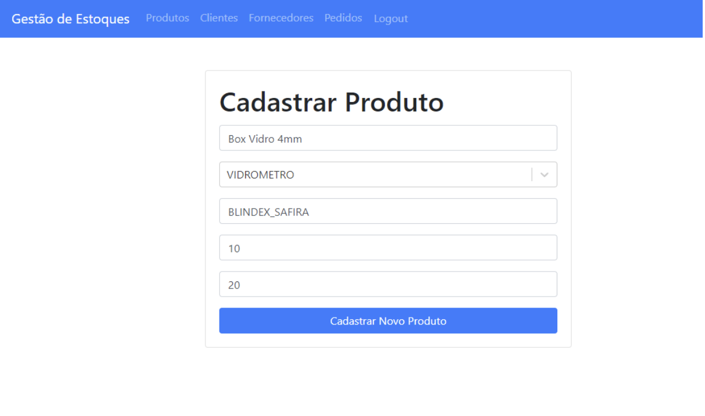

# Testes de Software
Para a realização dos testes, definimos como usuário um gestor da empresa selecionada. 

## Caso de teste 1: Listar Produtos
Identificador: CT-001

Requisitos associados: R-001 - O sistema deve permitir a listagem de todos os produtos cadastrados.

Objetivo do teste: Verificar se o sistema está listando corretamente todos os produtos armazenados no banco de dados.

Passos:
- Acessar a página de produtos.
- Verificar se todos os produtos cadastrados estão sendo listados.
  
Critérios de êxito: Todos os produtos presentes no banco de dados devem ser exibidos na página.

## Caso de teste 2: Cadastro de Novo Produto
Identificador: CT-002

Requisitos associados: R-002 - O sistema deve permitir o cadastro de novos produtos.

Objetivo do teste: Verificar se o sistema está cadastrando novos produtos corretamente.

Passos:
- Acessar a página de cadastro de produto.
- Preencher os campos obrigatórios: Nome, Fornecedor, Modelo, Preço, Quantidade.
- Submeter o formulário de cadastro.
- Verificar se o produto foi cadastrado e listado corretamente na página de produtos.
  
Critérios de êxito: O produto deve ser exibido na listagem de produtos após o cadastro.

## Caso de teste 3: Deletar Produto
Identificador: CT-003

Requisitos associados: R-003 - O sistema deve permitir a exclusão de produtos.

Objetivo do teste: Verificar se o sistema está deletando os produtos corretamente.

Passos:
- Acessar a página de produtos.
- Selecionar um produto para exclusão.
- Confirmar a exclusão do produto.
- Verificar se o produto foi removido da listagem de produtos.
  
Critérios de êxito: O produto deve ser removido da listagem de produtos após a exclusão.

## Caso de teste 4: Listar Clientes
Identificador: CT-004

Requisitos associados: R-004 - O sistema deve permitir a listagem de todos os clientes cadastrados. 

Objetivo do teste: Verificar se o sistema está listando corretamente todos os clientes armazenados no banco de dados.

Passos:
- Acessar a página de clientes.
- Verificar se todos os clientes cadastrados estão sendo listados.

Critérios de êxito: Todos os clientes presentes no banco de dados devem ser exibidos na página.

## Caso de teste 5: Cadastro de Novo Cliente
Identificador: CT-005

Requisitos associados: R-005 - O sistema deve permitir o cadastro de novos clientes.

Objetivo do teste: Verificar se o sistema está cadastrando novos clientes corretamente.

Passos:
- Acessar a página de cadastro de cliente.
- Preencher os campos obrigatórios: Nome, CPF, Telefone, CEP.
- Submeter o formulário de cadastro.
- Verificar se o cliente foi cadastrado e listado corretamente na página de clientes.
  
Critérios de êxito: O cliente deve ser exibido na listagem de clientes após o cadastro.

## Caso de teste 6: Deletar Cliente
Identificador: CT-006

Requisitos associados: R-006 - O sistema deve permitir a exclusão de clientes.

Objetivo do teste: Verificar se o sistema está deletando os clientes corretamente.

Passos:
- Acessar a página de clientes.
- Selecionar um cliente para exclusão.
- Confirmar a exclusão do cliente.
- Verificar se o cliente foi removido da listagem de clientes.
  
Critérios de êxito: O cliente deve ser removido da listagem de clientes após a exclusão.

## Caso de teste 7: Listar Pedidos
Identificador: CT-007

Requisitos associados: R-007 - O sistema deve permitir a listagem de todos os pedidos cadastrados.

Objetivo do teste: Verificar se o sistema está listando corretamente todos os pedidos armazenados no banco de dados.

Passos:
- Acessar a página de pedidos.
- Verificar se todos os pedidos cadastrados estão sendo listados.
Critérios de êxito: Todos os pedidos presentes no banco de dados devem ser exibidos na página.

## Caso de teste 8: Cadastro de Novo Pedido
Identificador: CT-008

Requisitos associados: R-008 - O sistema deve permitir o cadastro de novos pedidos.

Objetivo do teste: Verificar se o sistema está cadastrando novos pedidos corretamente.

Passos:
- Acessar a página de cadastro de pedido.
- Preencher os campos obrigatórios: Produto, Cliente, Quantidade.
- Submeter o formulário de cadastro.
- Verificar se o pedido foi cadastrado e listado corretamente na página de pedidos.
  
Critérios de êxito: O pedido deve ser exibido na listagem de pedidos após o cadastro.

## Caso de teste 9: Deletar Pedido
Identificador: CT-009

Requisitos associados: R-009 - O sistema deve permitir a exclusão de pedidos.

Objetivo do teste: Verificar se o sistema está deletando os pedidos corretamente.

Passos:
- Acessar a página de pedidos.
- Selecionar um pedido para exclusão.
- Confirmar a exclusão do pedido.
- Verificar se o pedido foi removido da listagem de pedidos.
  
Critérios de êxito: O pedido deve ser removido da listagem de pedidos após a exclusão.

## Caso de teste 10: Login com Credenciais Válidas
Identificador: CT-010

Requisitos associados: R-010 - O sistema deve permitir que os usuários façam login com credenciais válidas.

Objetivo do teste: Verificar se o sistema está autenticando corretamente os usuários com credenciais válidas.

Passos:
- Acessar a página de login.
- Inserir um email válido.
- Inserir a senha correspondente ao email válido.
- Submeter o formulário de login.
- Verificar se o usuário é redirecionado para a página inicial após o login bem-sucedido.
  
Critérios de êxito: O usuário deve ser redirecionado para a página inicial após o login com credenciais válidas.

## Caso de teste 11: Login com Credenciais Inválidas
Identificador: CT-011

Requisitos associados: R-011 - O sistema deve mostrar uma mensagem de erro ao tentar fazer login com credenciais inválidas.

Objetivo do teste: Verificar se o sistema está lidando corretamente com tentativas de login usando credenciais inválidas.

Passos:
- Acessar a página de login.
- Inserir um email inválido ou uma senha incorreta.
- Submeter o formulário de login.
- Verificar se uma mensagem de erro é exibida na página de login.
  
Critérios de êxito: Uma mensagem de erro deve ser exibida indicando que as credenciais são incorretas.

## Caso de teste 12: Redirecionamento após Login
Identificador: CT-012

Requisitos associados: R-012 - O sistema deve redirecionar o usuário autenticado para a página inicial. 

Objetivo do teste: Verificar se o sistema redireciona o usuário para a página inicial após um login bem-sucedido.

Passos:
- Realizar login com credenciais válidas.
- Verificar se o usuário é redirecionado para a página inicial.

Critérios de êxito: O usuário deve ser redirecionado para a página inicial após o login.

## Caso de teste 13: Acesso a Rotas Protegidas sem Autenticação
Identificador: CT-013

Requisitos associados: R-013 - O sistema deve restringir o acesso a rotas protegidas para usuários não autenticados.

Objetivo do teste: Verificar se o sistema impede o acesso a rotas protegidas quando o usuário não está autenticado.

Passos:
- Tentar acessar uma rota protegida (como "/produtos") sem estar autenticado.
- Verificar se o sistema redireciona o usuário para a página de login.
  
Critérios de êxito: O usuário deve ser redirecionado para a página de login ao tentar acessar uma rota protegida sem estar autenticado.

## Caso de teste 14: Acesso a Rotas Protegidas com Autenticação
Identificador: CT-014

Requisitos associados: R-014 - O sistema deve permitir o acesso a rotas protegidas para usuários autenticados. 

Objetivo do teste: Verificar se o sistema permite o acesso a rotas protegidas quando o usuário está autenticado.

Passos:
- Realizar login com credenciais válidas.
- Tentar acessar uma rota protegida (como "/produtos").
- Verificar se o usuário tem acesso à rota protegida.
  
Critérios de êxito: O usuário deve ter acesso à rota protegida após realizar o login.

## Caso de teste 15: Logout
Identificador: CT-015

Requisitos associados: R-015 - O sistema deve permitir que o usuário faça logout. 

Objetivo do teste: Verificar se o sistema permite que o usuário faça logout corretamente.

Passos:
- Realizar login com credenciais válidas.
- Clicar no botão de logout.
- Verificar se o usuário é redirecionado para a página de login e se o acesso às rotas protegidas é negado após o logout.
  
Critérios de êxito: O usuário deve ser redirecionado para a página de login e o acesso às rotas protegidas deve ser negado após o logout.

